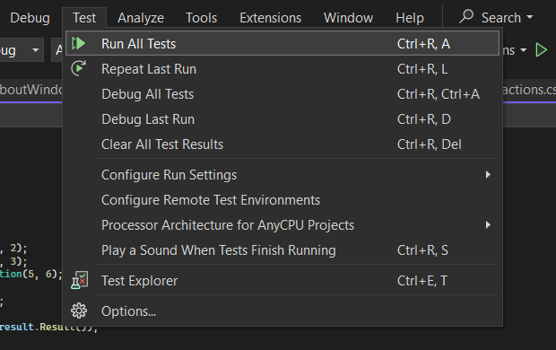
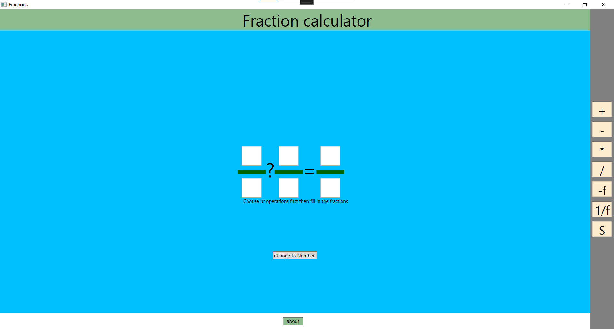
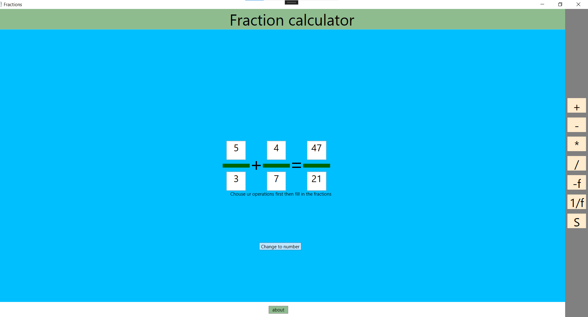
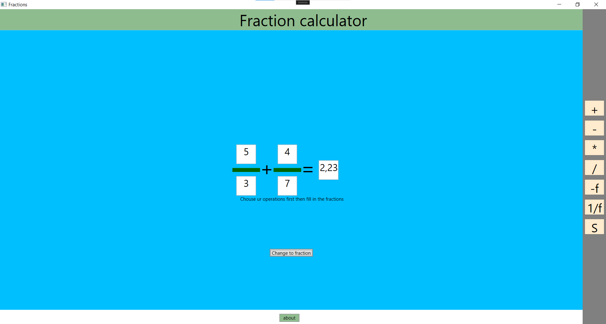
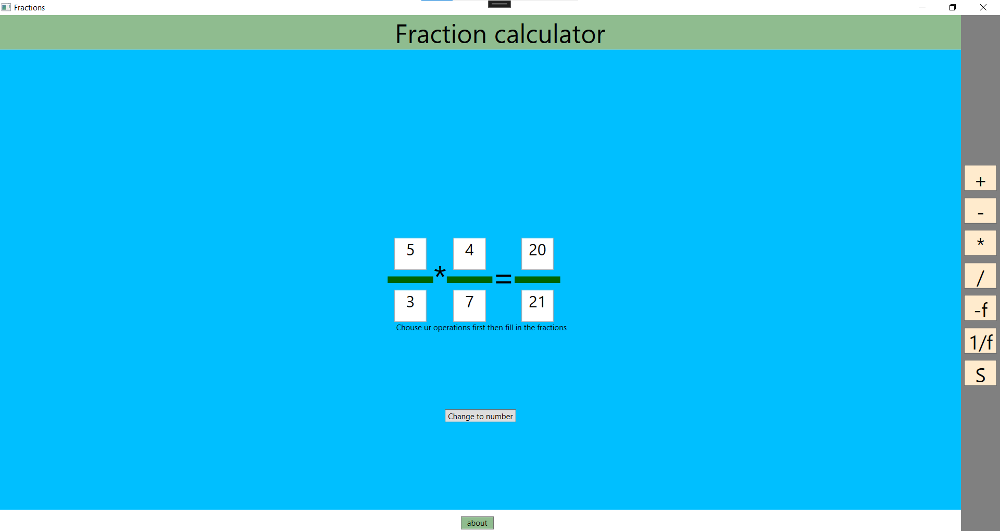

# Fraction app
Author : Sam De Wispelaere
## project description 
1. Demontration app
    - This is a quick test to check if the fraction library works in the terminal.
2. Fractions library 
    - This is the library that is used everywhere in the solution to calculate the fractions.
3. WPF
    - In the wpf there are 2 different windows there is the main window where u can calculate the fractions and there is also a second window about with some information on. There is also some code behinde these 2 windows.

## Unit test 
- TestAdd: Tests the addition operation between two fractions.
- TestSubtract: Tests the subtraction operation between two - fractions.
- TestMultiply: Tests the multiplication operation between two fractions.
- TestDivide: Tests the division operation between two fractions.
- TestReciProcal: Tests the calculation of the reciprocal of a fraction.
- TestInvert: Tests the inversion of the sign of a fraction.
- TestSimplify: Tests the simplification of a fraction to its simplest form.
- TestResult: Tests the method that calculates the decimal representation of a fraction.
- TestToString: Tests the overridden ToString method to ensure it returns the correct string representation of a fraction.
- TestAdd_WithNegativeFraction: Tests addition with a negative fraction.
- TestSubtract_WithNegativeResult: Tests subtraction resulting in a negative fraction.
- TestMultiply_ByZero: Tests multiplication by zero.
- TestDivide_ByZero: Tests division by zero.
- TestSimplify_WithNegativeFraction: Tests simplification of a negative fraction.

### how to run it 
1. Make sure your project references the your library namespace containing ur class.
2. Add the xUnit testing framework to your project.
3. Build your project to ensure that all necessary dependencies are resolved.
4. Now to run the unit tests click here. 

## Fraction Class

A simple C# class to represent fractions.

### Attributes

- `-numerator: int`: Private attribute representing the numerator of the fraction.
- `-denominator: int`: Private attribute representing the denominator of the fraction.

### Properties

- `+ <<get/set>> Numerator: int`: Public property to access and modify the numerator attribute.
- `+ <<get/set>> Denominator: int`: Public property to access and modify the denominator attribute. It automatically changes to 1 if set to 0.

### Constructors

- `+ Fraction()`: Default constructor initializing the fraction to 0/0.
- `+ Fraction(numerator: int, denominator: int)`: Parameterized constructor setting the fraction to the provided numerator and denominator.

### Methods

- `+ Add(right: Fraction): Fraction`: Adds the given fraction to the current fraction.
- `+ Subtract(right: Fraction): Fraction`: Subtracts the given fraction from the current fraction.
- `+ Multiply(right: Fraction): Fraction`: Multiplies the current fraction by the given fraction.
- `+ Divide(right: Fraction): Fraction`: Divides the current fraction by the given fraction. If the given fraction numerator automatically changes to 1 if set to 0.
- `+ Reciprocal(): Fraction`: Returns the reciprocal of the current fraction.
- `+ Invert(): Fraction`: Returns the current fraction with its sign inverted.
- `+ Simplify(): Fraction`: Simplifies the current fraction to its simplest form.
- `+ Result(): string`: Returns the decimal representation of the fraction.
- `+ ToString(): string`: Overrides the default `ToString` method to return a string representation of the fraction.

## Screenshots
Opening app:

Add:

Change to number:

Multiply:

Simplify:

About window: 

## Future inprovments 
1. I could add other calculation and not only the fractions.
2. Maybe some quality of live changes but i would need some feedback first what other people think could be better ect.

# Fraction-

